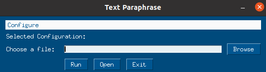
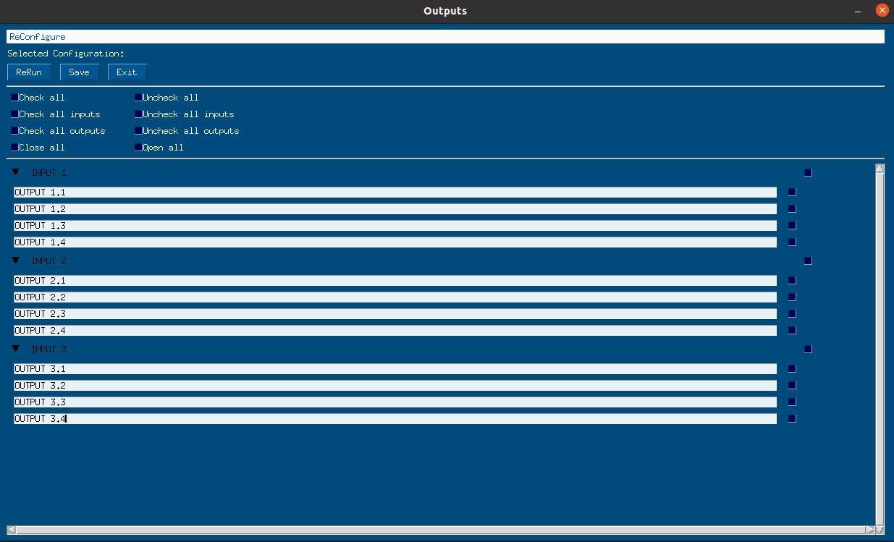
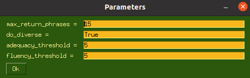
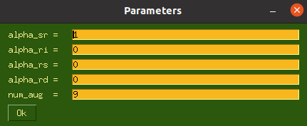
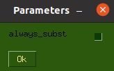
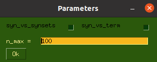

# req_paraphrases

## Overview

req_paraphrases is an application that generates paraphrases of software requirements 
using different techniques.

## Techniques

The user can generate the paraphrased requirements choosing between the following techniques:

- **Parrot**

Paraphrase framework that modifies the syntax of the phrase.

- **Eda**

Tool that uses WordNet and allows replacing words with synonyms, executing random insertions, 
random swaps and random deletion.

- **No Context**

Technique that systematically replaces all non stopwords with all their synonyms found in WordNet.

- **First Best Wup**

Technique that replaces non stopwords with their best synonym found in WordNet.
The best synonym is the synonym with the higher score
calculated using the ```wup_similarity()``` method provided by WordNet.

- **Second Best Wup**

Technique that replaces non stopwords with their second best synonym found in WordNet.
The second best synonym is the synonym with the second higher score
calculated using the ```wup_similarity()``` method provided by WordNet.

- **First Best w2v**

Technique that replaces non stopwords with their best synonym found in WordNet.
The best synonym is the synonym with the higher score
calculated using the ```similarity()``` method provided by KeyedVectors from gensim.models.keyedvectors.

- **Second Best w2v**

Technique that replaces non stopwords with their second best synonym found in WordNet.
The second best synonym is the synonym with the second higher score
calculated using the ```similarity()``` method provided by KeyedVectors from gensim.models.keyedvectors.

- **Hyper w2v**

Technique that replaces non stopwords with their best hypernym found in WordNet.
The best hypernym is the hypernym with the higher score
calculated using the ```similarity()``` method provided by KeyedVectors from gensim.models.keyedvectors.

- **Hypon w2v**

Technique that replaces non stopwords with their best hyponym found in WordNet.
The best hyponym is the hyponym with the higher scoring 
calculated using the ```similarity()``` method provided by KeyedVectors from gensim.models.keyedvectors.

## Gui

In order to generate the paraphrased requirements file, the user must follow these steps:



- choose a file through the button **Browse**.
- choose a technique and its configurable parameters through the button **Configure**.
- process the file through the button **Run**.



- modify one or more output phrases **clicking** on it.
- select one or more output phrases through the **checkboxes**.
- if you want to save the selected phrases.
  - click on **Save**.
- if you want to process again the selected phrases.
  - choose a technique and its configurable parameters through the button **ReConfigure**.
  - click on **Run**.

### Configurable Parameters

For each technique the user can configure some parameters: 
the user can run the algorithm with the default (and recommended) configuration 
clicking on the button **Ok**,
**otherwise** the user can change the values of the parameters.

- Parrot

  - **max_return_phrases** is the maximum number of returned phrases (0,15)
  - **do_diverse** makes the output phrase more diverse from the original (True, False)
  - **adequacy_threshold** is the coefficient of how much the meaning of the output phrase is close to the original (0,10)
  - **fluency_threshold** is the coefficient of how much the output phrase is fluent in english (0,10)



- Eda
  - **alpha_sr** is the replacement coefficient (0,10)
  - **alpha_ri** is the insertion coefficient (0,10)
  - **alpha_rs** is the swap coefficent (0,10)
  - **alpha_rd** is the deletion coefficient (0,10)
  - **num_aug** is the maximum number of genereted sentences (0,10)



- No Context

Check **always_subst** if you only want to make replacements with synonyms different from the original word.



- Others

Check **syn_vs_synsets** if you want to calculate the score of each synonym/hypernym/hyponym by comparing it with both ù
the original terms of the phrase and their synonyms.

Check **syn_vs_term** if you want to calculate the score of each synonym/hypernym/hyponym by comparing it only with 
the original terms of the phrase.

**n_max** is the percentage of words of the original phrase that will be randomly selected to be 
replaced (with their best/second best synonym/hypernym/hyponym), in the i-th phrase i replacements are made 
and n-max phrases are returned. (0,100)





## Installation

Install **Anaconda**.

Create a **Virtual Environment** and activate it.

To install all **Required Libraries** run the following command:
```
./installation.sh
```

Open the **Python's interactive shell** by running `python` and then type the following commands:
```
>>> import nltk
>>> nltk.download('stopwords')
>>> nltk.download('punkt')
>>> nltk.download('averaged_perceptron_tagger')
>>> nltk.download('universal_tagset')
>>> nltk.download('wordnet')
```
Exit the shell by running `quit()`.

Eventually, download the **Model** that can be found to this 
[link](http://doi.org/10.5281/zenodo.1199620) into the directory **project**.